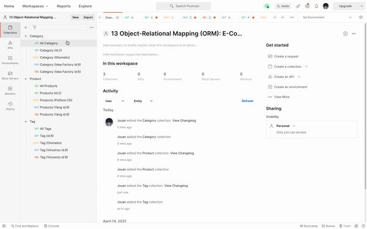
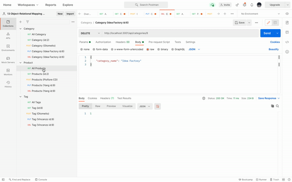
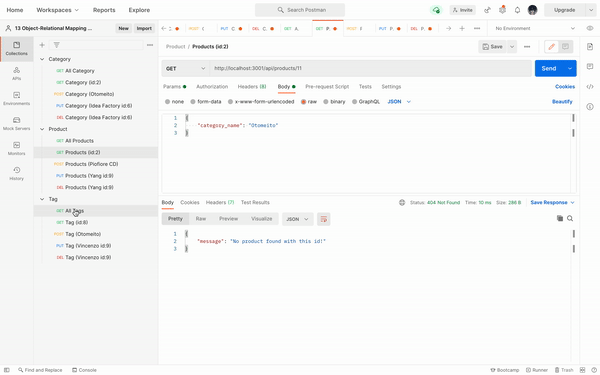

   

# 13.Object-Relational Mapping (ORM): E-Commerce Back End

## Description
We had been learning how to use ORM to orgnize and use express to connect to server. I learn how to structure connection between database and grab the information from database to use in the server. It was challenge to get the information associated with each other in this wasy and using route for specific detail into back-end server. Over all I enjoy the process of seeing database being edit, add and delet by GET, POST and PUT methods. 

## Usage

Demo:

-Category Part

-Product Part

-Tag Part

## License
MIT 

## Badges

## Questions
        Please feel free to contact: 
        Github:https://github.com/anniechen9025/
        Email:anniechen9025@gmail.com
